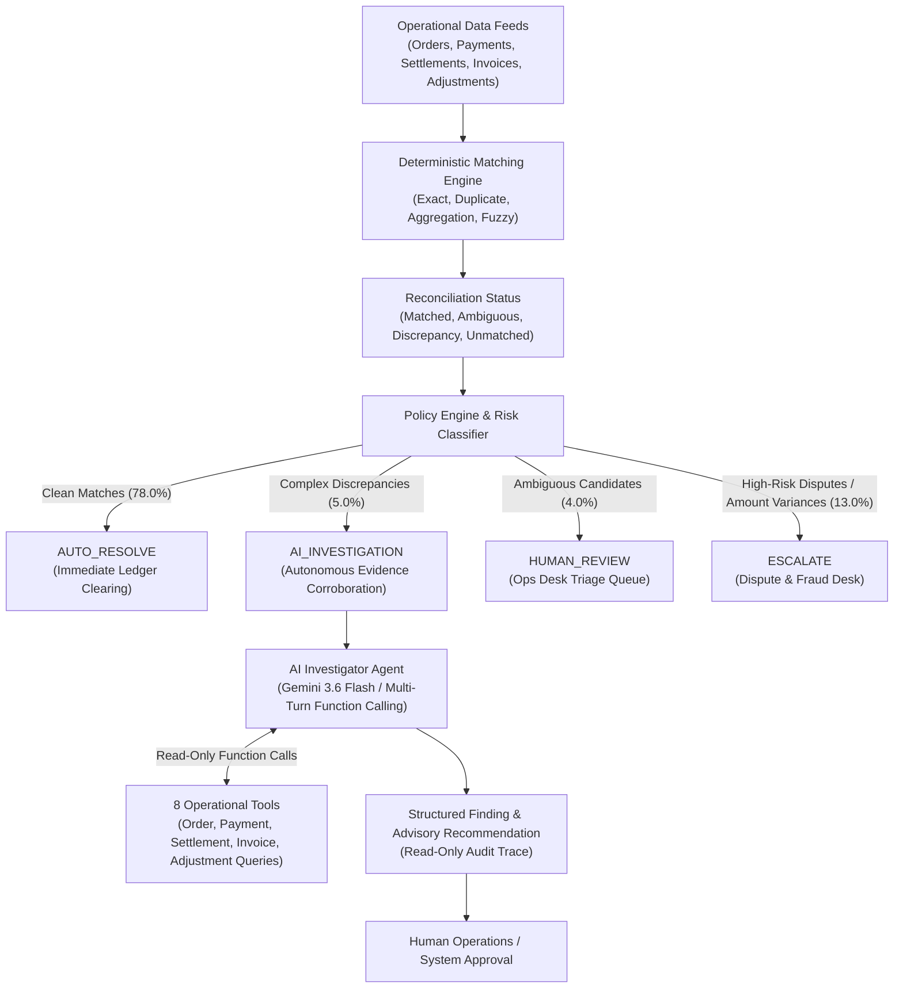

# ReconGuard

> **Deterministic-First AI Finance Controller for Payment Reconciliation and Exception Investigation**
> *Razorpay Buildathon — Track 04 / AI Finance Controller*

---

## Executive Summary

Payment reconciliation across checkout orders, payment gateways, bank settlement files, tax invoices, and dispute adjustments is historically fragmented and high-friction. Finance operations teams often rely on either brittle regex rules or unconstrained LLM wrappers that hallucinate financial actions.

**ReconGuard** establishes an enterprise-grade hybrid architecture:
1. **Deterministic-First**: High-volume, structured transaction matching is handled entirely by a rule-based engine across 4 specialized matching strategies.
2. **Policy-Governed**: An independent Policy Engine classifies every exception by financial exposure and risk tier, deciding whether a case is safe to auto-resolve, requires autonomous evidence collection, or must be escalated immediately.
3. **Read-Only AI Investigator**: Genuinely ambiguous cases are routed to an autonomous LLM agent equipped with 8 strictly read-only operational tools to corroborate evidence chains across disparate transaction records without any write authority.
4. **Human/System Action**: The AI investigator generates advisory recommendations with root-cause traces; all final approval authority remains outside the AI agent.



---

## Core Philosophy & Safety Invariants

| Architectural Principle | Implementation Reality |
| :--- | :--- |
| **Deterministic First** | 82.0% of cases are resolved by deterministic algorithms in <50ms without invoking an LLM. |
| **AI Only Where Rules Break** | AI is reserved exclusively for complex reference typos, rounding variances, and omitted invoice cross-checks. |
| **0 Financial Write Endpoints** | The API layer and tool registry contain **zero write/mutation methods**. No payments, refunds, settlements, or invoices can be modified or created by the AI. |
| **Advisory Recommendations Only** | AI outputs include explicit disclaimers: *"No financial action was taken by the investigator."* Case approvals remain human/system governed. |
| **Strict Ground-Truth Isolation** | Production runtime, matching algorithms, policy logic, and AI tools have zero access to benchmark ground-truth labels (verified via AST static analysis tests). |

---

## Technical Architecture

```
ReconGuard Platform
├── Frontend UI (React 19 + TypeScript + Vite + Tailwind CSS v4)
│   ├── Overview Dashboard (Executive metrics, exposure breakdown, demo launchers)
│   ├── Case Explorer (Server-side search, multi-field filtering, pagination)
│   ├── Case Detail (5-stage transaction lifecycle chain, UTR comparison callout)
│   ├── Inline AI Investigation Workflow (5 operational states, provider toggle)
│   └── AI Investigations Registry & Audit Trace (Ordered tool call history)
│
├── REST API Layer (FastAPI + Pydantic v2 + SQLite)
│   ├── GET  /health & /api/health
│   ├── GET  /api/dashboard/summary
│   ├── GET  /api/cases (Query params: page, page_size, decision, priority, exception_type, search)
│   ├── GET  /api/cases/{case_id} & /api/cases/{case_id}/evidence
│   ├── GET  /api/investigations & /api/investigations/{case_id}
│   └── POST /api/cases/{case_id}/investigate (Read-only trigger)
│
├── Autonomous AI Investigator (Google GenAI SDK + Gemini 3.6 Flash)
│   ├── Agentic Multi-Turn Function Calling (Max 6 iterations)
│   ├── 8 Read-Only Tools (lookup_order, lookup_payment, lookup_settlement, lookup_invoice, etc.)
│   ├── Deterministic MockProvider (Offline testing & instant reproduction)
│   └── Structured Pydantic Output (FindingTaxonomy, Root Cause, Confidence, Supporting IDs)
│
├── Policy & Exception Management Engine
│   ├── 4 Policy Decisions (AUTO_RESOLVE, AI_INVESTIGATION, HUMAN_REVIEW, ESCALATE)
│   ├── 3 Priority Levels (HIGH, MEDIUM, LOW)
│   └── Dual-Axis Financial Impact & Exposure Calculator
│
└── Deterministic Reconciliation Engine
    ├── ExactMatcher (1:1 Amount, Currency, and Reference matching)
    ├── DuplicateDetector (Multi-capture & duplicate authorization detection)
    ├── AggregationMatcher (1:N and N:1 batch settlement reconciliation)
    └── FuzzyMatcher (Levenshtein reference typo matching with temporal tolerance)
```

---

## Operational Dataset

The dataset represents a controlled, synthetic operational simulation modeling real-world payment lifecycle scenarios across 5 interconnected entities:

| Data Entity | Records | File Path | Key Attributes Modeled |
| :--- | :---: | :--- | :--- |
| **Orders** | 1,000 | `data/generated/orders.csv` | Order ID, Merchant ID, Customer ID, Amount, Currency, Status, Timestamp |
| **Payments** | 976 | `data/generated/payments.csv` | Payment ID, Order ID, Amount, Gateway Fee, Gateway UTR, Status, Timestamp |
| **Settlements** | 906 | `data/generated/settlements.csv` | Settlement ID, Gross Amount, Fee, Tax, Net Payout, Bank UTR, Payout Status |
| **Invoices** | 970 | `data/generated/invoices.csv` | Invoice ID, Order ID, Gross Amount, Tax Amount, Invoice Status |
| **Adjustments** | 68 | `data/generated/adjustments.csv` | Adjustment ID, Related Payment ID, Type (Chargeback/Refund), Reason |
| **Ground Truth** | 1,000 | `data/ground_truth/ground_truth.csv` | Independent benchmark labels used solely for evaluation scoring |

### 13 Modeled Operational Scenarios
- **Clean Baseline**: Exact 1:1 match across all 5 entities.
- **Reference Discrepancies**: UTR character transposition (`...12` vs `...21`) between gateway and bank feeds.
- **Financial Variances**: Sub-cent rounding variances vs macro amount discrepancies.
- **Timing & Batch Anomalies**: Gateway settlement SLA delays and multi-order aggregated batch payouts.
- **Disputes & Adjustments**: Chargeback disputes, customer refunds, and omitted merchant tax invoices.

---

## Evaluation & Benchmark Metrics

### 1. Deterministic Engine Performance (1,000 Cases)

```
================================================================================
RECONGUARD DETERMINISTIC EVALUATION BENCHMARK
================================================================================
Total Operational Volume:             1,000 cases
Runtime Execution Speed:              0.0477 seconds (1,000 cases evaluated)

Deterministic Resolution Coverage:    82.00% (820 / 1,000 cases resolved)
Deterministic Correctness Rate:       95.12% (780 / 820 resolved cases confirmed clean)
Classification Accuracy:              93.90% (939 / 1,000 cases)
Payment Entity Linkage F1:            100.00%
Settlement Entity Linkage F1:         94.84%
False Match Count (Safety):           40 cases (Subtle variances safely routed to AI)
```

> [!NOTE]
> **Metric Clarification**: The deterministic engine resolves **820 cases** (82.0% coverage). Of those, **780 cases** are clean exact matches auto-resolved with zero human intervention. The remaining **40 cases** contain subtle reference typos or rounding variances that the Policy Engine isolates and safely routes to the AI Investigator.

### 2. Policy Decision Distribution

| Policy Tier | Volume | Percentage | Financial Exposure | Routing SOP |
| :--- | :---: | :---: | :---: | :--- |
| **`AUTO_RESOLVE`** | 780 | 78.0% | ₹0.00 | Instant automated ledger clearance |
| **`AI_INVESTIGATION`** | 50 | 5.0% | ₹1.00 | Autonomous read-only evidence corroboration |
| **`HUMAN_REVIEW`** | 40 | 4.0% | ₹249,960.00 | Assigned to operations desk triage queue |
| **`ESCALATE`** | 130 | 13.0% | ₹859,130.50 | Escalated to financial risk and dispute desk |
| **Total** | **1,000** | **100.0%** | **₹1,109,091.50** | Fully accounted exposure |

### 3. Live Gemini Benchmark Reality

During the live 50-case benchmark on `gemini-3.6-flash`:
- **Attempted**: 50 cases
- **Completed**: 5 cases (before provider Free Tier HTTP 429 quota exhaustion)
- **Investigation Finding Accuracy**: **5 / 5 (100%)**
- **Entity Linkage Accuracy**: **5 / 5 (100%)**
- **Quota Impact**: The remaining 45 requests were blocked by Google API Free Tier rate limits (HTTP 429), not model misclassifications. All rate-limited requests cleanly and safely escalated to human review.

> **Model Configuration**: `gemini-3.6-flash` was used for this specific historical benchmark via an explicit `GEMINI_MODEL_NAME` override. The repository's default model — used out-of-the-box with no override — is `gemini-2.5-flash`. See [Local Installation](#local-installation--quickstart) below to configure either.

---

## Canonical Demo Scenarios

ReconGuard includes 1-click demo launchers directly on the dashboard for immediate judge walkthroughs:

### 1. Hero Case — `CASE-000921` (`REFERENCE_MISMATCH` $\rightarrow$ `AI_INVESTIGATION`)
- **Discrepancy**: Payment Gateway UTR is `UTR-IND-00092112`, while Bank Settlement UTR is `UTR-IND-00092121` (character transposition `12` vs `21`).
- **Autonomous AI Workflow**:
  1. Executes `lookup_order(order_id='ORD-000921')` $\rightarrow$ Validates order amount ₹1,299.00.
  2. Executes `lookup_payment(payment_id='PAY-000897')` $\rightarrow$ Retrieves gateway UTR.
  3. Executes `lookup_settlement(settlement_id='SET-000857')` $\rightarrow$ Retrieves bank UTR.
  4. Executes `lookup_invoice` and `lookup_adjustments` $\rightarrow$ Confirms tax invoice and zero disputes.
- **Corroborated Finding**: `VERIFIED_REFERENCE_TYPO` at 96% confidence.
- **Advisory Output**: Recommends settlement linkage for human/system approval; zero database mutations executed.

### 2. Baseline Case — `CASE-000001` (`EXACT_MATCH` $\rightarrow$ `AUTO_RESOLVE`)
- **Status**: Clean 1:1 order/payment/settlement exact match. Auto-resolved deterministically without AI intervention with 100% confidence.

### 3. High-Risk Dispute — `CASE-000853` (`CHARGEBACK` $\rightarrow$ `ESCALATE`)
- **Status**: Chargeback adjustment recorded against gateway payment. Policy engine flags high priority and escalates immediately to the financial risk desk.

---

## Local Installation & Quickstart

### Prerequisites
- Python 3.11+
- Node.js 18+ and npm
- Optional: `GEMINI_API_KEY` for live LLM investigations (MockProvider works out-of-the-box offline)
- Optional: `GEMINI_MODEL_NAME` to override the Gemini model used (defaults to `gemini-2.5-flash` if unset)

### 1. Backend Setup

```bash
# Clone the repository
git clone https://github.com/anya2203/ReconGuard.git
cd ReconGuard

# Create and activate virtual environment
python -m venv .venv
# On Windows:
.\.venv\Scripts\activate
# On Linux/macOS:
# source .venv/bin/activate

# Install dependencies
pip install -r requirements.txt

# (Optional) Configure Gemini API Key and model
# Set in your local environment or .env file (never committed)
# set GEMINI_API_KEY=your_key_here
# set GEMINI_MODEL_NAME=gemini-2.5-flash   (optional; this is already the default if unset)

# Start the FastAPI backend server
python -m uvicorn app.main:app --host 127.0.0.1 --port 8000
```
Backend Swagger API documentation will be available at `http://127.0.0.1:8000/docs`.

### 2. Frontend Setup

```bash
# In a new terminal window:
cd frontend

# Install Node packages
npm install

# Start the Vite development server
npm run dev -- --port 3000
```
Open `http://127.0.0.1:3000` in your browser to interact with the console.

### 3. Automated Verification & Testing

```bash
# Run the complete Python test suite (141 tests)
python -m pytest -q

# Verify clean bytecode compilation (0 errors)
python -m compileall app

# Run the frontend production build
cd frontend
npm run build
```

---

## Repository Structure

```
ReconGuard/
├── app/
│   ├── api/                     # FastAPI routes, schemas, and dependencies
│   │   ├── routes/              # /dashboard, /cases, /investigations, /health
│   │   └── schemas/             # Pydantic request/response models
│   ├── evaluation/              # Ground-truth evaluation benchmarks & metrics
│   ├── investigator/            # Autonomous AI agent, tools, and providers
│   │   ├── agent.py             # Multi-turn agent loop coordinator
│   │   ├── providers.py         # GeminiProvider (GenAI SDK) & MockProvider
│   │   ├── tools.py             # 8 read-only operational tool implementations
│   │   └── types.py             # FindingTaxonomy and investigation schemas
│   ├── matching/                # Deterministic reconciliation engine & matchers
│   ├── models/                  # Operational entity dataclasses
│   ├── policy/                  # PolicyEngine risk classifier & ExceptionQueue
│   ├── services/                # Singleton ReconciliationService bridge
│   └── main.py                  # FastAPI application entrypoint
│
├── frontend/                    # React 19 + TypeScript + Vite + Tailwind CSS SPA
│   ├── src/
│   │   ├── components/          # Cards, Badges, Formatters, States, Workflow
│   │   ├── pages/               # Overview, CaseExplorer, CaseDetail, Investigations
│   │   ├── services/            # Typed API client
│   │   └── types/               # TypeScript interface schemas matching backend
│   └── vite.config.ts           # Vite build & proxy configuration
│
├── data/
│   ├── generated/               # Synthetic operational feeds (CSV)
│   └── ground_truth/            # Independent benchmark ground truth (CSV)
│
├── evaluation/
│   └── results/                 # Verified evaluation artifacts & JSON benchmarks
├── docs/                        # Technical architecture & daily milestones
└── tests/                       # 141 automated unit, integration, & AST tests
```

---

## Honest Limitations

1. **Synthetic Operational Dataset**: The dataset is a controlled, deterministic simulation modeling 13 realistic anomaly scenarios; it is not live production bank data.
2. **LLM Provider Quota Limits**: Live multi-turn tool calling on Google Gemini Free Tier is subject to strict per-minute quota limits. `MockProvider` is provided for deterministic, zero-quota evaluation and testing.
3. **Strict Read-Only Scope**: ReconGuard deliberately avoids executing automated financial mutations (no payouts, no balance adjustments). Real-world accounting integrations require an external human approval workflow.

---

## License

This project was built for the **Razorpay Buildathon 2026** under the Apache 2.0 License.
