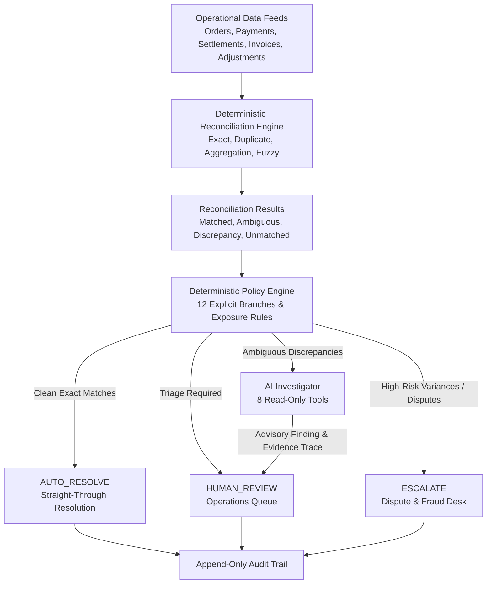

# ReconGuard — AI Finance Controller

> **A deterministic-first financial reconciliation engine with policy-governed, read-only AI exception investigation.**  
> Built for **Razorpay AI Buildathon 2026** — *Track 04: AI Finance Controller*


---

## Overview

In fintech and merchant operations, financial reconciliation involves matching high volumes of checkout orders against gateway payment captures, bank settlement files, billing tax invoices, and dispute adjustments.

While over 80% of transactions match cleanly, the remaining ambiguous exceptions—such as character-transposed reference numbers (UTRs), sub-cent GST rounding variances, and omitted invoice feeds—traditionally force operations teams into manual ticket triage. Conversely, delegating financial ledger mutations directly to an unconstrained LLM creates severe risks of hallucinations and unauthorized balance alterations.

**ReconGuard** resolves this tradeoff through a hybrid architecture:
- **Deterministic Reconciliation**: High-speed, rule-based algorithms resolve clean transactions with mathematical certainty.
- **Deterministic Policy Engine**: Explicit rules determine whether a discrepancy is safe to auto-resolve, requires evidence collection, or must be escalated immediately.
- **Read-Only AI Investigator**: Genuinely ambiguous cases are investigated by an autonomous AI agent equipped with 8 strictly read-only tools to corroborate multi-entity evidence chains without write authority.
- **Human Control & Auditability**: High-risk financial actions remain under human control, with every lifecycle event preserved in an immutable, append-only audit trail.

> *"ReconGuard reconciles what can be proven, investigates what is ambiguous, and keeps high-risk financial decisions under policy and human control."*

---

## The Problem

High-volume payment reconciliation across multiple data feeds presents distinct engineering challenges:

1. **Multi-Feed Asynchrony**: Merchant checkout orders, gateway payment notifications, bank settlement files, and billing invoices arrive on different schedules and with varying reference schemas.
2. **Brittle Rule Systems**: Rigid regex and exact matching scripts fail on benign operational noise, such as single-character UTR transmission typos or standard line-item tax rounding differences.
3. **Operational Triage Burden**: Ambiguous mismatches create massive exception backlogs that require manual cross-referencing across separate databases.
4. **The AI Safety Dilemma**: Giving generative AI autonomous authority to write to financial ledgers, initiate refunds, or alter balances is unacceptable in regulated financial systems.

---

## The Solution

ReconGuard uses a **deterministic-first, policy-governed** architecture. The AI is not an autonomous actor with ledger access; it is an analytical investigator that gathers operational evidence and presents structured advisory findings.



---

## How ReconGuard Works

ReconGuard processes financial transactions through seven distinct stages:

1. **Operational Records Ingestion**: Ingests structured feeds across orders, payment gateway captures, bank settlement files, tax billing invoices, and adjustment logs.
2. **Deterministic Reconciliation**: The matching engine executes 4 specialized matching strategies (Exact Match, Duplicate Detection, 1:N Aggregation, and Temporal Levenshtein Fuzzy Matching) to verify data congruence.
3. **Policy Classification**: The 12-branch Policy Engine evaluates match status, financial exposure, and failed verification checks, assigning each case to one of four definitive decisions: `AUTO_RESOLVE`, `AI_INVESTIGATION`, `HUMAN_REVIEW`, or `ESCALATE`.
4. **AI Investigation (Eligible Cases Only)**: If routed to `AI_INVESTIGATION`, the autonomous agent queries operational records using 8 read-only tools to evaluate cross-entity linkages (e.g., verifying if amounts, timestamps, and customer IDs match despite a UTR typo).
5. **Structured Advisory Recommendation**: The investigator produces a structured finding, a confidence score, a root-cause explanation, and a full tool execution trace. All recommendations explicitly state that no financial records were modified.
6. **Human Operations Control**: High-risk cases and AI-investigated findings are presented to operations personnel for final review. AI failure or inconclusive evidence automatically defaults to human review.
7. **Append-Only Audit Trail**: Every reconciliation result, policy decision, AI tool call, and human triage requirement is recorded with ISO 8601 timestamps in an immutable audit timeline.

*AI does not perform exact financial reconciliation. It is invoked only when deterministic rules identify ambiguity.*

---

## Key Features

1. **Deterministic Matching Engine**: Fast multi-strategy matching engine processing operational feeds straight-through without AI latency or token cost.
2. **12-Branch Deterministic Policy Engine**: Classifies exceptions into discrete risk tiers based on monetary impact, exception taxonomy, and verification criteria.
3. **Read-Only AI Investigator**: Multi-turn tool-calling agent equipped with 8 specific operational query tools to corroborate evidence across tables.
4. **Evidence-Based Root Cause Diagnosis**: Generates auditable explanations for reference transpositions, rounding differences, and omitted invoice cross-checks.
5. **Financial Exposure Tracking**: Tracks gross monetary variance across exception queues, maintaining exact parity before and after investigations.
6. **Append-Only Audit Trail**: Chronological, immutable logging of all system actions, tool arguments, and human review assignments.
7. **Transparent Provider Modes & Fail-Safe Handling**: Supports `Live Gemini` (Google GenAI SDK), `MockProvider` (offline evaluation), and `Demo Replay` (deterministic walkthroughs), with automatic fail-safe human escalation upon API errors.

---

## AI Safety & Control Boundary

ReconGuard maintains a strict separation between autonomous investigation and financial execution authority.

| AI CAN (Read-Only Investigation) | AI CANNOT (Restricted Financial Actions) |
| :--- | :--- |
| Query order, payment, settlement, and invoice records | Modify database tables, balances, or ledger entries |
| Compare UTR references and timestamps across tables | Initiate refunds, payouts, or disbursements |
| Check for active chargeback or refund dispute logs | Alter bank settlement records or fee structures |
| Calculate numerical variances between feeds | Override Policy Engine decisions or risk tiers |
| Synthesize evidence and generate advisory findings | Convert an exception into `AUTO_RESOLVE` |
| Produce tool execution traces for human review | Bypass human signoff on high-risk disputes |

> **Core Boundary**: *"AI investigates. Policy decides. Humans control risk."*

---

## Dashboard

ReconGuard includes a dedicated React + TypeScript finance controller interface built with Vite and Tailwind CSS.

- **Controller Overview**: High-level telemetry displaying total volume, straight-through auto-resolution counts, active financial exposure, exception priority breakdown, and benchmark metrics.
- **Case Explorer**: Server-side searchable, paginated case table with multi-field filters for Policy Decision, Priority, Exception Type, and Control Owner (`ENGINE`, `AI AGENT`, `OPS DESK`, `DISPUTE DESK`).
- **Case Detail View**: Comprehensive transaction lifecycle chain mapping order checkout, payment capture, bank settlement, tax invoice, and adjustment records alongside UTR comparison callouts.
- **AI Safety & Boundary Panel**: Explicit visual confirmation of agent boundary limits (read-only tools active, 0 write tools).
- **Interactive Investigation Workflow**: Transparent provider selection (`Demo Replay`, `Mock Provider`, `Live Gemini`), execution trace viewer with expandable tool arguments, and fail-safe human escalation states.
- **Audit Trail Timeline**: Chronological event feed detailing all system, policy, AI, and human desk actions for any given case.

*The production frontend is located in [`frontend/`](frontend/), and design specifications and information architecture are documented in [`dashboard-design/`](dashboard-design/).*

---

## Evaluation

ReconGuard was evaluated against an independent ground-truth dataset across 1,000 synthetic operational cases modeling 13 realistic transaction anomaly scenarios.

### Verified Benchmark Results

| Evaluation Metric | Measured Result | Operational Meaning |
| :--- | :---: | :--- |
| **Total Operational Cases** | **1,000 cases** | Full benchmark test volume across 13 anomaly scenarios |
| **Deterministic Resolution Coverage** | **82.00%** (820 / 1,000) | Cases resolved straight-through without invoking AI |
| **Deterministic Correctness Rate** | **95.12%** (780 / 820) | Resolved cases confirmed as clean 1:1 exact matches |
| **Overall Classification Accuracy** | **93.90%** (939 / 1,000) | Exception taxonomy classifications matching ground truth |
| **Binary Exception Detection F1** | **100.00%** | Zero false negatives on financial anomaly detection |
| **Payment Entity Linkage F1** | **100.00%** | Order-to-gateway capture linkage accuracy |
| **Settlement Entity Linkage F1** | **94.84%** | Bank settlement reference linkage accuracy |
| **Total Financial Exposure Identified** | **₹1,109,091.50** | Total monetary variance isolated and brought under governance |

### Understanding the Metrics
- **82.00% Coverage**: The deterministic engine resolves 820 cases straight-through. Of these, 780 are clean exact matches (`AUTO_RESOLVE`), while 40 contain minor discrepancies safely isolated for triage.
- **93.90% Classification Accuracy**: Measures the system's ability to categorize exceptions into exact taxonomies (e.g., distinguishing reference typos from missing invoices).
- **₹1,109,091.50 Exposure**: Represents the gross financial variance identified across exception cases, not money recovered.

---

## AI Evaluation & Provider Reality

To maintain transparency, the repository clearly delineates offline evaluation from live API execution:

- **MockProvider (Offline Evaluation)**: Evaluated across all 50 ambiguous discrepancy cases in the benchmark dataset, achieving 100% finding accuracy (50/50) with deterministic, reproducible tool execution.
- **Live Gemini Provider (`gemini-2.5-flash` / `gemini-3.6-flash`)**: During live evaluation against the Google GenAI API on the 50 AI cases:
  - **5 cases completed** successfully before provider Free Tier quota exhaustion (HTTP 429).
  - All 5 completed cases achieved **100% finding and linkage accuracy**.
  - The remaining **45 cases encountered rate limits** and cleanly escalated to human review as designed.

> *We do not use the 5 completed live Gemini cases to claim general live-model production accuracy. Live LLMs are subject to real-world rate limits, which is why ReconGuard's fail-safe design routes provider errors directly to human operations triage.*

---

## Auditability

Every case in ReconGuard maintains an immutable, chronological audit trail:

- **Reconciliation Events (`RECONCILIATION_COMPLETED`)**: Records the matching engine's status, matched entity IDs, and timestamp.
- **Policy Events (`POLICY_DECISION`)**: Records the deterministic policy rule applied, assigned risk tier, and explanation.
- **AI Investigation Events (`AI_INVESTIGATION_STARTED`, `AI_INVESTIGATION_COMPLETED`, `AI_INVESTIGATION_FAILED`)**: Logs provider used, tools executed, synthesized findings, confidence scores, and advisory recommendations.
- **Human Review Events (`HUMAN_REVIEW_REQUIRED`)**: Automatically emitted whenever a case requires operations or dispute desk action.
- **Read-Only Audit API**: Served via `GET /api/audit` and `GET /api/audit/{case_id}` with zero mutation endpoints.

---

## Failure Recovery

ReconGuard enforces a critical financial invariant:

$$\text{AI Failure} \neq \text{Financial Failure}$$

```
AI Provider Error / HTTP 429 / Timeout / Malformed Response
                           ↓
   1. Set Status = RATE_LIMITED / PROVIDER_ERROR / MALFORMED_RESPONSE
   2. Set Finding = INCONCLUSIVE, Confidence = 0.0
   3. Emit Audit Event: AI_INVESTIGATION_FAILED
   4. Emit Audit Event: HUMAN_REVIEW_REQUIRED (Desk: OPERATIONS_DESK)
   5. Retain Original Policy Decision (NEVER converted to AUTO_RESOLVE)
   6. Preserve Active Financial Exposure (Zero Mutations)
```

If an upstream LLM provider is unavailable or returns unparseable JSON, the system degrades safely to human review without blocking operational pipelines or guessing on financial records.

---

## Testing

ReconGuard includes a comprehensive test suite of **179 automated tests**:

```text
============================== test session starts ==============================
tests/test_matching.py ................................................... [ 28%]
tests/test_policy.py ........................                              [ 41%]
tests/test_investigator.py ...........................................     [ 65%]
tests/test_api.py ........................                                 [ 79%]
tests/test_audit.py ............                                           [ 85%]
tests/test_benchmark.py ...                                               [ 87%]
tests/test_ai_resilience.py ..........                                     [ 93%]
tests/test_adversarial.py ............                                     [100%]
======================== 179 passed, 1 warning in 58.02s ========================
```

- **Matching Tests (51)**: Unit tests for Exact, Duplicate, Aggregation, and Fuzzy matching algorithms.
- **Policy Engine Tests (24)**: Verification of all 12 policy decision branches and priority mappings.
- **Investigator Tests (43)**: Unit tests for all 8 read-only query tools and agent rule synthesis.
- **API Tests (24)**: Integration tests across dashboard, case explorer, and investigation endpoints.
- **Audit Trail Tests (12)**: Immutability, chronological ordering, and secret sanitization tests.
- **Benchmark Tests (3)**: Automated assertions verifying telemetry generation and metric consistency.
- **AI Resilience Tests (10)**: Verification of rate-limit handling, timeouts, malformed responses, and iteration limits.
- **Adversarial Red-Team Tests (12)**: Security tests proving zero financial write endpoints, ground-truth isolation, and policy immutability.

---

## Quickstart

### Prerequisites
- Python 3.11+
- Node.js 18+ and npm
- *(Optional)* Google Gemini API Key (only required for live Gemini mode; offline Mock and Demo Replay work out-of-the-box)

### 1. Clone Repository & Setup Backend

```bash
# Clone repository
git clone https://github.com/anya2203/ReconGuard.git
cd ReconGuard

# Create and activate Python virtual environment
# Windows:
python -m venv .venv
.\.venv\Scripts\activate

# Linux / macOS:
# python3 -m venv .venv
# source .venv/bin/activate

# Install backend dependencies
pip install -r requirements.txt

# (Optional) Configure Gemini API Key
# Windows: set GEMINI_API_KEY=your_api_key_here
# Linux/macOS: export GEMINI_API_KEY=your_api_key_here

# Start FastAPI backend server
python -m uvicorn app.main:app --host 127.0.0.1 --port 8000
```
Backend API documentation will be available at `http://127.0.0.1:8000/docs`.

### 2. Setup & Start Frontend

```bash
# In a new terminal window:
cd frontend

# Install dependencies
npm install

# Start Vite development server
npm run dev -- --port 3000
```
Open `http://127.0.0.1:3000` in your browser.

### 3. Run Automated Verification

```bash
# Run complete test suite (179 tests)
python -m pytest -q

# Run benchmark evaluation
python evaluation/run_benchmark.py

# Verify frontend production build
cd frontend
npm run build
```

---

## API Reference

The FastAPI backend exposes read-only query routes and an investigation trigger:

| Method | Endpoint | Purpose | Write Authority |
| :--- | :--- | :--- | :---: |
| `GET` | `/health` / `/api/health` | Service health status check | Read-Only |
| `GET` | `/api/dashboard/summary` | Executive KPI and financial exposure summary | Read-Only |
| `GET` | `/api/dashboard/benchmark` | Verified benchmark evaluation metrics | Read-Only |
| `GET` | `/api/cases` | Filterable, paginated case explorer feed | Read-Only |
| `GET` | `/api/cases/{case_id}` | Detailed case record and policy decision | Read-Only |
| `GET` | `/api/cases/{case_id}/evidence` | Linked transaction evidence across data feeds | Read-Only |
| `GET` | `/api/investigations` | List of historical AI investigation findings | Read-Only |
| `GET` | `/api/investigations/{case_id}` | Investigation details and tool execution trace | Read-Only |
| `POST`| `/api/cases/{case_id}/investigate` | Trigger read-only AI investigation workflow | Read-Only (0 writes) |
| `GET` | `/api/audit` | System-wide audit event feed | Read-Only |
| `GET` | `/api/audit/{case_id}` | Chronological audit trail timeline for a case | Read-Only |

**Total Financial Write / Mutation Endpoints**: **0**

---

## Project Structure

```
ReconGuard/
├── app/                         # Backend implementation (FastAPI, SQLite, SQLAlchemy)
│   ├── api/                     # REST API routes and Pydantic v2 schemas
│   ├── investigator/            # Autonomous AI agent (8 read-only tools, Gemini, Mock, Demo Replay)
│   ├── matching/                # Deterministic matching engine (Exact, Duplicate, Aggregation, Fuzzy)
│   ├── models/                  # Operational entity dataclasses & AuditLog model
│   ├── policy/                  # Deterministic 12-branch PolicyEngine & ExceptionQueue
│   └── services/                # Singleton ReconciliationService & Audit trail manager
│
├── frontend/                    # Production dashboard (React 19, TypeScript, Vite, Tailwind CSS)
│   ├── src/components/          # ControllerHealth, BenchmarkMetricsCard, AuditTrail, AIBoundary
│   └── src/pages/               # OverviewPage, CaseExplorerPage, CaseDetailPage, InvestigationsPage
│
├── dashboard-design/            # UX documentation, information architecture, & component specs
│   ├── README.md                # Dashboard product overview & core UX narrative
│   ├── information-architecture.md # Navigation hierarchy and component data flow
│   └── dashboard-spec.md        # Master component specification & safety guarantees
│
├── evaluation/                  # Benchmark scripts and evaluation results
│   ├── run_benchmark.py         # Standalone end-to-end benchmark evaluation script
│   └── results/                 # Machine-readable JSON and Markdown benchmark reports
│
├── docs/                        # Architecture, audit trail specifications, & design decisions
│   └── submission/              # Buildathon pitch deck, 5-minute demo script, & Judge FAQ
│
├── data/                        # Synthetic operational data feeds & independent ground truth
│   ├── generated/               # Orders, payments, settlements, invoices, adjustments CSVs
│   └── ground_truth/            # Independent evaluation labels (isolated from runtime)
│
└── tests/                       # 179 automated tests across matching, policy, AI, API, and safety
```

---

## Limitations

1. **Synthetic Operational Dataset**: Evaluated on 1,000 synthetic operational records modeling 13 anomaly scenarios rather than live banking data with PII.
2. **LLM Free Tier Quota Limits**: Live Gemini investigations are constrained by upstream API rate limits. `DemoReplayProvider` and `MockProvider` are provided for deterministic evaluation and testing.
3. **Strictly Read-Only Scope**: ReconGuard does not automatically execute payouts, balance deductions, or ledger updates. Financial actions require human or external accounting system signoff.
4. **Financial Exposure vs. Recovery**: The ₹1,109,091.50 figure represents identified gross monetary variance across exception queues, not guaranteed recovered revenue.

---

## Buildathon Judging Alignment

| Evaluation Criteria | ReconGuard Implementation & Proof |
| :--- | :--- |
| **Problem Taste** | Solves high-volume payment reconciliation by pairing deterministic matching for clean cases with targeted AI investigation for complex edge cases. |
| **Build Quality** | Complete working stack: FastAPI backend, 179 passing tests, React 19 + TypeScript frontend, and 0 financial write endpoints. |
| **AI Judgment** | Uses AI only where deterministic rules break (reference typos, rounding variances, omitted invoices). Agent is restricted to 8 read-only tools. |
| **Failure Recovery** | Rate limits, timeouts, and malformed responses fail safely to `INCONCLUSIVE` and route directly to human triage without altering policy decisions. |

---

## Demo Flow

A 5-minute judge walkthrough covers:

1. **Executive Dashboard**: Review total volume (1,000 cases), straight-through auto-resolutions (780 cases), and active financial exposure (₹1.109M).
2. **Clean Deterministic Case (`CASE-000001`)**: Inspect an exact 1:1 match resolved straight-through via `AUTO_RESOLVE` with zero AI tokens used.
3. **Hero AI Case (`CASE-000921`)**: Run an autonomous investigation on a transposed UTR reference discrepancy (`...12` vs `...21`), inspecting the 5-step read-only tool trace and finding.
4. **Fail-Safe Degradation**: Trigger a simulated provider error to verify graceful degradation to `INCONCLUSIVE` and `OPERATIONS_DESK` escalation.
5. **Benchmark Telemetry & Audit Trail**: Inspect the chronological audit timeline and reproducible benchmark report.

---

## Buildathon Context

Built for the **Razorpay AI Buildathon 2026** — *Track 04: AI Finance Controller*.  
Licensed under the Apache 2.0 License.
