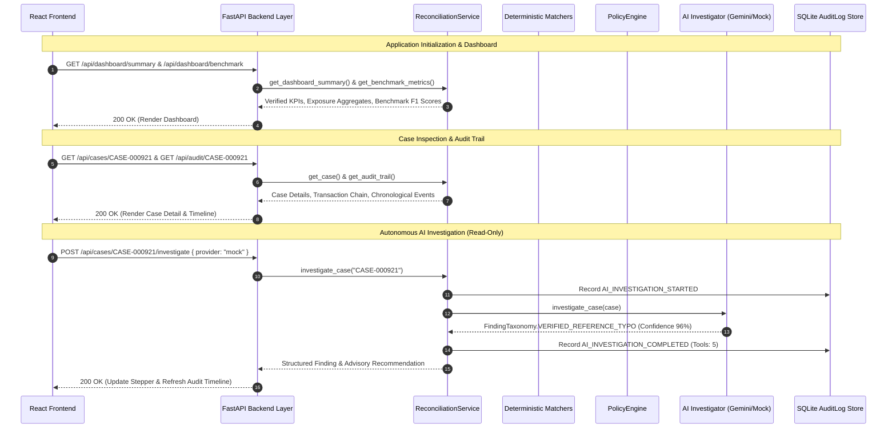

# ReconGuard Dashboard — Information Architecture

> **Navigation hierarchy, routing structure, component relationships, and data flow of the ReconGuard production frontend.**

---

## 1. Application Navigation Hierarchy

```
ReconGuard Web Console (React 19 + TypeScript + Vite + Tailwind CSS)
│
├── 1. Controller Overview (`/`)
│   ├── Mission Statement & Core Philosophy Banner
│   ├── Controller Health & Safety Invariants Bar
│   ├── 5 Primary KPI Cards (Volume, Auto-Resolve, AI, Human/Escalate, Exposure)
│   ├── Verified Benchmark & Performance Telemetry Card
│   ├── Curated Demo Scenarios Quick-Launcher (Hero, Exact Match, Dispute)
│   ├── Financial Exposure & Policy Distribution Card
│   ├── Deterministic Engine Reconciliation Breakdown Card
│   └── High-Priority Operational Exceptions Table
│
├── 2. Operational Case Explorer & Exception Queue (`/cases`)
│   ├── Global Multi-Criteria Search & Filter Header
│   ├── 1-Click Quick Preset Chips (All, AI, Human, Escalated, High Priority)
│   ├── Dropdown Selectors (Decision, Priority, Exception Type)
│   └── High-Density Case Queue Table
│       ├── Columns: Case ID, Order ID, Category, Decision, Priority, Owner, Strategy, Exposure, Action
│       ├── Control Owner Classifications (`ENGINE`, `AI AGENT`, `OPS DESK`, `DISPUTE DESK`)
│       └── Server-Side Pagination Controls (20, 50, 100 rows/page)
│
├── 3. Exception Case Detail & Audit Trace (`/cases/:caseId`)
│   ├── Executive Variance Snapshot (Expected, Actual, Financial Variance, Control Status)
│   ├── UTR Transposition Discrepancy Callout (Hero Case `CASE-000921`)
│   ├── 5-Stage Transaction Lifecycle Chain (Order → Payment → Settlement → Invoice → Adjustments)
│   ├── AI Safety & Control Boundary Panel (Read-only tools vs. prohibited mutations)
│   ├── Inline Autonomous AI Investigator Stepper & Findings
│   ├── Immutable Chronological Audit Trail Timeline (DETERMINISTIC, AI, HUMAN badges)
│   ├── Deterministic Policy Routing Rationale & SOP Card
│   └── Deterministic Evidence Raw JSON Drawer
│
└── 4. AI Investigations Registry (`/investigations`)
    ├── Filterable Registry of all AI-Investigated Cases
    └── Standalone Investigation Audit Page (`/investigations/:caseId`)
        ├── Investigation Findings, Root Cause, and Confidence Score
        ├── Read-Only Tool Execution Trace Stepper
        └── Raw Audit Record Payload
```

---

## 2. Page & Route Specifications

| Route Path | Page Component | Primary Persona | Purpose & Key Interactions |
| :--- | :--- | :--- | :--- |
| `/` | `OverviewPage` | VP Finance, Lead Controller | Executive overview of reconciliation rate, open financial exposure, and benchmark integrity. |
| `/cases` | `CaseExplorerPage` | Ops Controller, Triage Specialist | High-throughput exception queue triage and filtering across 1,000 cases. |
| `/cases/:caseId` | `CaseDetailPage` | Exception Investigator, Auditor | Complete 360-degree case inspection, transaction chain verification, AI investigation execution, and audit trail review. |
| `/investigations` | `InvestigationsPage` | AI Auditor, Compliance Officer | Central registry of all AI-assisted investigation runs and tool telemetry. |
| `/investigations/:caseId` | `InvestigationDetailPage` | Compliance Auditor | Deep-dive inspect drawer for multi-turn AI tool calling and reasoning. |

---

## 3. Data Flow & State Management



---

## 4. Design Language & Styling Invariants

- **Surfaces**: Clean white cards (`bg-white`), subtle slate borders (`border-slate-200`), minimal shadows (`shadow-xs`).
- **Typography**: Inter / system sans-serif for UI labels, monospace (`font-mono`) for identifiers, UTRs, timestamps, and financial figures.
- **Status & Source Color Palette**:
  - `DETERMINISTIC` / `AUTO_RESOLVE` / `EXACT_MATCH`: Emerald (`emerald-700`, `bg-emerald-50`)
  - `AI INVESTIGATION` / `REFERENCE_MISMATCH`: Indigo / Sky (`indigo-700`, `bg-indigo-50`)
  - `HUMAN CONTROL` / `HUMAN_REVIEW`: Amber (`amber-700`, `bg-amber-50`)
  - `ESCALATE` / `CHARGEBACK` / High Risk: Rose (`rose-700`, `bg-rose-50`)
- **Density**: Compact, information-dense fintech layouts without decorative fluff or glassmorphism.

