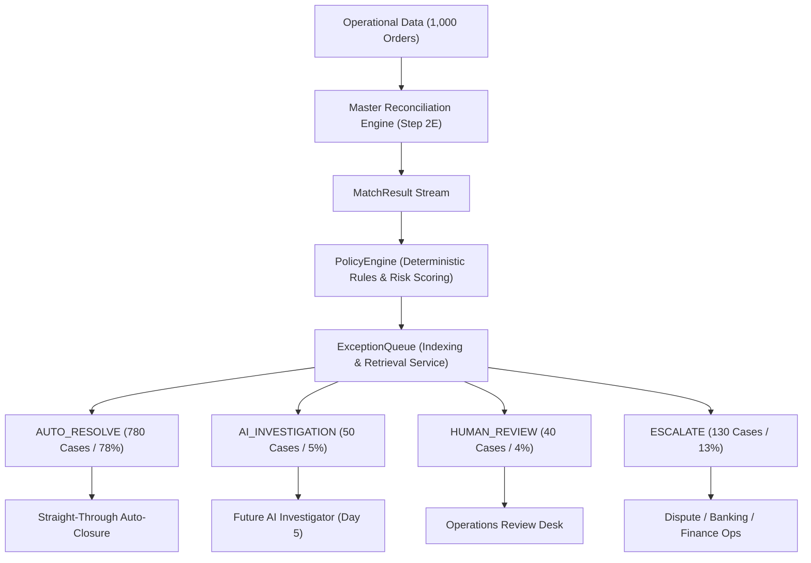
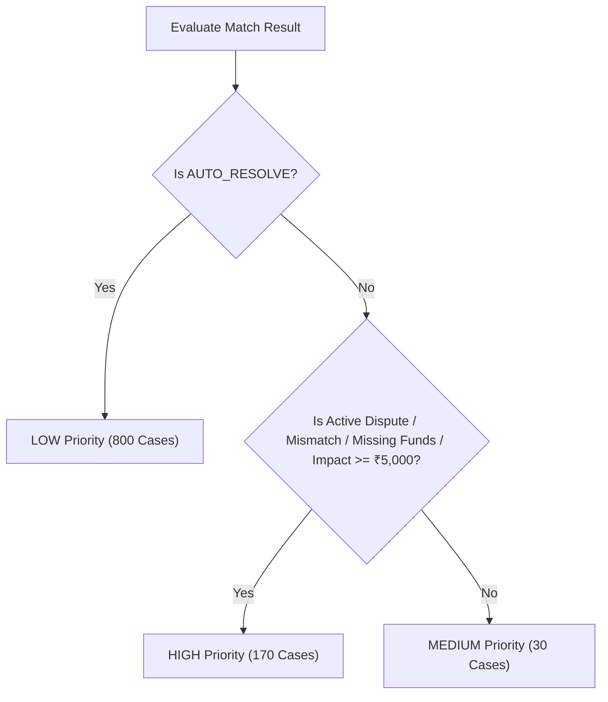

# ReconGuard — Day 4: Policy & Exception Orchestration Layer

**Execution Date**: 2026-08-25  
**Reconciliation Dataset**: 1,000 operational records (`v1.1.0`)  
**Architecture Layer**: Deterministic Policy & Exception Orchestration (`app/policy/`)  
**Status**: Verified (100/100 tests passing)

---

## 1. Architecture Overview

The **Policy & Exception Orchestration Layer** sits immediately downstream of the Master Reconciliation Engine and upstream of the AI Investigation / Operations layers. It transforms raw deterministic matching verdicts into actionable, risk-ranked business decisions with explainable audit trails.



---

## 2. Policy Decision Taxonomy

The policy layer defines 4 business decisions:

| Decision | Definition & Scope | Handling Mechanism | Volume | % of Dataset |
| :--- | :--- | :--- | :---: | :---: |
| **`AUTO_RESOLVE`** | 100% verified 1:1 matches and valid batch payouts with zero discrepancies. | Straight-through automated case closure. | **780** | 78.0% |
| **`AI_INVESTIGATION`** | Complex micro-variances (rounding, typos, missing invoice) with strong corroborating evidence. | Route to AI Investigator for root-cause discovery and automated adjustment booking. | **50** | 5.0% |
| **`HUMAN_REVIEW`** | Ambiguous retry duplicates and incomplete metadata where corroboration is insufficient. | Route to Operations Desk for manual confirmation. | **40** | 4.0% |
| **`ESCALATE`** | Active financial disputes, chargebacks, refunds, pricing mismatches, dropped payments, missing bank payouts. | Route to specialized finance/dispute desks with SLA tracking. | **130** | 13.0% |
| **Total** | | | **1,000** | **100.0%** |

---

## 3. Deterministic Policy Rules & Mapping Table

Every reconciliation match result is evaluated against explainable rules without ground-truth leakage:

| Scenario / Trigger | Engine Match Status | Engine Match Method | Exception Type | Policy Decision | Risk Priority | Requires AI | Requires Human | Next Action Workflow |
| :--- | :--- | :--- | :--- | :--- | :--- | :---: | :---: | :--- |
| **`EXACT_MATCH`** (720) | `MATCHED` | `EXACT` | `NONE` | `AUTO_RESOLVE` | `LOW` | No | No | Straight-through auto-closure. |
| **`MULTI_ORDER_SETTLEMENT`** (60) | `MATCHED` | `AGGREGATION` | `NONE` | `AUTO_RESOLVE` | `LOW` | No | No | Batch payout auto-closure. |
| **`ROUNDING_MISMATCH`** (20) | `MATCHED` | `FUZZY` | `ROUNDING_VARIANCE` | `AI_INVESTIGATION` | `LOW` | **Yes** | No | AI analyzes GST itemized rounding & books adjustment. |
| **`REFERENCE_TYPO`** (20) | `MATCHED` | `FUZZY` | `REFERENCE_MISMATCH` | `AI_INVESTIGATION` | `MEDIUM` | **Yes** | No | AI corroborates transposed UTR & links ledger. |
| **`MISSING_INVOICE`** (10) | `DISCREPANCY` | `FUZZY` | `MISSING_INVOICE` | `AI_INVESTIGATION` | `MEDIUM` | **Yes** | No | AI verifies payment/settlement & schedules invoice backfill. |
| **`AMBIGUOUS_CANDIDATE`** (20) | `AMBIGUOUS` | `NONE` | `AMBIGUOUS_CANDIDATE` | `HUMAN_REVIEW` | `HIGH` | No | **Yes** | Operations resolves customer retry duplicate payment. |
| **`INSUFFICIENT_EVIDENCE`** (20) | `UNMATCHED` | `NONE` | `INSUFFICIENT_EVIDENCE` | `HUMAN_REVIEW` | `HIGH` | No | **Yes** | Operations reviews abandoned order against merchant logs. |
| **`AMOUNT_MISMATCH`** (24) | `DISCREPANCY` | `NONE` | `AMOUNT_MISMATCH` | `ESCALATE` | `HIGH` | No | **Yes** | Finance ops investigates transaction pricing discrepancy. |
| **`DELAYED_SETTLEMENT`** (24) | `DISCREPANCY` | `FUZZY` | `SLA_BREACH` | `ESCALATE` | `HIGH` | No | **Yes** | Banking ops reviews SLA delayed bank payout. |
| **`MISSING_PAYMENT`** (24) | `UNMATCHED` | `NONE` | `MISSING_PAYMENT` | `ESCALATE` | `HIGH` | No | **Yes** | Gateway ops traces uncaptured webhook transaction. |
| **`CHARGEBACK_ADJUSTMENT`** (24)| `DISCREPANCY` | `NONE` | `CHARGEBACK` | `ESCALATE` | `HIGH` | No | **Yes** | Dispute desk initiates representment / defense. |
| **`REFUND`** (24) | `DISCREPANCY` | `NONE` | `REFUND` | `ESCALATE` | `HIGH` | No | **Yes** | Merchant ops verifies customer refund debit. |
| **`MISSING_SETTLEMENT`** (10) | `DISCREPANCY` / `AMBIGUOUS` | `NONE` | `MISSING_SETTLEMENT` | `ESCALATE` | `HIGH` | No | **Yes** | Banking ops traces missing bank payout. |

---

## 4. Priority & Risk Scoring Logic

The Policy Engine assigns operational priority tiers based on financial exposure and exception criticality:



### Risk Tier Breakdown
- **`HIGH` Priority (170 cases / ₹1,109,090.50 exposure)**:
  - Active chargebacks (`CHARGEBACK`: 24 cases, ₹237,179.00)
  - Customer refunds (`REFUND`: 24 cases, ₹289,080.00)
  - Large amount mismatches (`AMOUNT_MISMATCH`: 24 cases, ₹36,000.00)
  - Missing payments (`MISSING_PAYMENT`: 24 cases, ₹165,778.50)
  - Missing settlements (`MISSING_SETTLEMENT`: 10 cases, ₹131,093.00)
  - Duplicate retry payment collisions (`AMBIGUOUS_CANDIDATE`: 20 cases, ₹49,980.00)
  - Incomplete checkouts with manual debits (`INSUFFICIENT_EVIDENCE`: 20 cases, ₹199,980.00)
  - SLA delayed settlements (`DELAYED_SETTLEMENT`: 24 cases, ₹0.00 direct discrepancy)
- **`MEDIUM` Priority (30 cases / ₹0.00 exposure)**:
  - Reference character typos (`REFERENCE_MISMATCH`: 20 cases)
  - Missing billing records (`MISSING_INVOICE`: 10 cases)
- **`LOW` Priority (800 cases / ₹1.00 exposure)**:
  - Straight-through exact matches (`EXACT_MATCH`: 720 cases)
  - Multi-order batch settlements (`MULTI_ORDER_SETTLEMENT`: 60 cases)
  - Sub-rupee rounding variances (`ROUNDING_VARIANCE`: 20 cases, ₹0.05 per order)

---

## 5. Exception Lifecycle & Case Model

Each `ExceptionCase` data structure encapsulates the complete audit trail:

```python
@dataclass
class ExceptionCase:
    case_id: str                          # Stable case identifier (e.g. 'CASE-000001')
    order_id: str                         # Business order ID (e.g. 'ORD-000001')
    decision: PolicyDecision              # AUTO_RESOLVE | AI_INVESTIGATION | HUMAN_REVIEW | ESCALATE
    exception_type: ExceptionType         # Exception categorization
    priority: CasePriority                # HIGH | MEDIUM | LOW
    financial_impact: float               # Monetary exposure in INR
    payment_ids: list[str]                # Corroborated payment identifiers
    settlement_ids: list[str]             # Corroborated settlement identifiers
    invoice_id: str | None                # Invoice identifier
    adjustment_ids: list[str]             # Dispute / refund identifiers
    match_method: str                     # EXACT | FUZZY | AGGREGATION | NONE
    match_confidence: float               # Numeric confidence score (0.0 to 1.0)
    evidence: dict[str, Any]              # Explainable matching evidence
    reason: str                           # Engine diagnostic summary
    explanation: str                      # Human-auditable policy explanation
    next_action: str                      # Prescribed downstream action
    requires_ai: bool                     # Target for AI Investigator
    requires_human: bool                  # Target for Human Operations Desk
    created_at: str                       # ISO 8601 timestamp
```

---

## 6. Explainability Examples

Every policy decision generates auditable explanations and actionable next steps:

### Example 1: Rounding Variance (`AI_INVESTIGATION`)
- **Order ID**: `ORD-000901`
- **Engine Result**: `MATCHED` via `FUZZY` (Score: 1.00, Diff: ₹0.05)
- **Policy Decision**: `AI_INVESTIGATION`
- **Explanation**: *"High-confidence match with micro-amount variance of INR 0.05 (itemized GST/paisa rounding). Requires AI investigation to justify variance and post rounding adjustment."*
- **Next Action**: *"Route to AI Investigator for itemized GST rounding variance root-cause analysis and automated adjustment booking."*

### Example 2: Ambiguous Retry Duplicate (`HUMAN_REVIEW`)
- **Order ID**: `ORD-000951`
- **Engine Result**: `AMBIGUOUS` (Multiple candidate payments: `PAY-000927`, `PAY-000928`)
- **Policy Decision**: `HUMAN_REVIEW`
- **Explanation**: *"Multiple (2) candidate payments detected for single order (customer retry ambiguity). Manual ops verification required."*
- **Next Action**: *"Escalate to operations desk to review candidate payments, confirm valid capture, and initiate duplicate refund if necessary."*

### Example 3: Chargeback Dispute (`ESCALATE`)
- **Order ID**: `ORD-000853`
- **Engine Result**: `DISCREPANCY` (Adjustment `ADJ-000001` present)
- **Policy Decision**: `ESCALATE`
- **Explanation**: *"Active chargeback dispute logged (INR 2499.00). Requires dispute management and representment workflow."*
- **Next Action**: *"Escalate to dispute desk for chargeback defense and liability management."*

---

## 7. Policy Safety Principles

1. **Conservative Straight-Through Processing**: The policy layer **never** auto-resolves a case solely because a candidate exists. Fuzzy matches are safely intercepted and routed to `AI_INVESTIGATION`.
2. **Ambiguity Protection**: Duplicate customer retries are never collapsed into an arbitrary single payment; they are routed directly to `HUMAN_REVIEW`.
3. **Dispute Isolation**: Any active chargeback or refund immediately halts straight-through settlement and is escalated with `HIGH` priority.
4. **Complete Coverage Invariant**: Every input transaction receives exactly one policy decision ($\sum \text{Decisions} = 1,000$). No transactions are lost or dual-routed.

---

## 8. Test & Runtime Performance

- **Policy Unit & Integration Test Suite**: `pytest tests/test_policy.py -q` $\rightarrow$ **18 passed in 0.92s**
- **Total Test Suite**: `pytest -q` $\rightarrow$ **100 passed in 7.90s**
- **Compilation Check**: `python -m compileall app` $\rightarrow$ **0 errors**
- **Policy Engine 1,000-Order Evaluation Runtime**: **< 0.015s**

