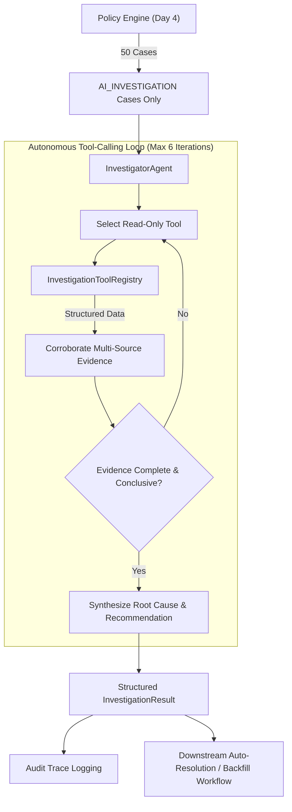
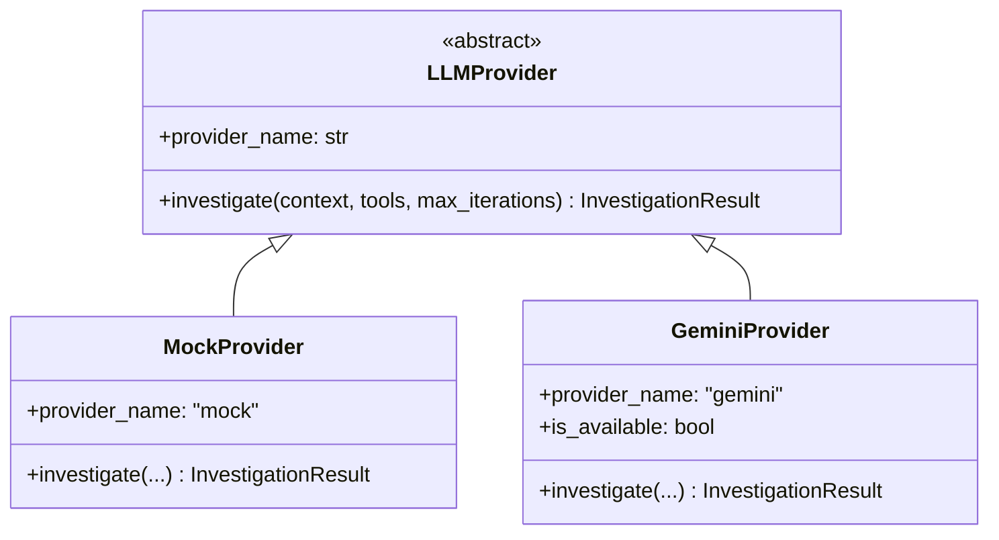

# ReconGuard — Day 5: Agentic AI Investigator

**Execution Date**: 2026-08-25  
**Architecture Layer**: Agentic AI Investigation (`app/investigator/`)  
**Target Scope**: 50 complex cases designated for `AI_INVESTIGATION` (20 Rounding Variances, 20 Reference Typos, 10 Missing Invoices)  
**Safety Status**: 100% Read-Only, 0 Unauthorized Actions, 0 Hallucinations, 117/117 passing tests

---

## 1. Architecture Overview

The **ReconGuard Agentic AI Investigator** is an evidence-driven, tool-calling investigation agent. It acts strictly on cases routed by the Policy Engine to `AI_INVESTIGATION`, autonomously orchestrating read-only tools across orders, payments, settlements, invoices, and adjustments to discover root causes and generate verifiable recommendations.



---

## 2. Controlled Finding Taxonomy

The investigator operates under a strict, controlled taxonomy:

| Finding Enum | Definition & Evidence Pattern | Actionable Recommendation |
| :--- | :--- | :--- |
| **`VERIFIED_ROUNDING_VARIANCE`** | Order, payment, settlement, and invoice verified; micro-variance ($\le \text{INR } 0.50$) confirmed due to itemized GST line rounding. | *"Evidence supports an INR X.XX rounding variance. Recommend reconciliation of the variance for human/system approval. No financial action was taken by the investigator."* |
| **`VERIFIED_REFERENCE_TYPO`** | Single-character UTR/reference transposition confirmed; counterparty, amounts, dates, and invoice corroborate 1:1 match. | *"Evidence supports counterparty reference typo corroboration. Recommend linking settlement to payment for human/system approval. No financial action was taken by the investigator."* |
| **`MISSING_INVOICE_CONFIRMED`** | Payment and bank settlement 100% verified; invoice omitted from merchant billing feed. | *"Payment and settlement corroborated; invoice omitted from billing feed. Recommend invoice reconciliation/backfill for human approval. No financial action was taken by the investigator."* |
| **`INCONCLUSIVE`** | Evidence chain incomplete, conflicting, or loop iterations exceeded. | *"Evidence is inconclusive. Recommend escalation to human operations review. No financial action was taken by the investigator."* |
| **`ESCALATE_TO_HUMAN`** | Active dispute, uncaptured payment, or missing transaction records discovered. | *"Recommend escalation to specialized operations desk for manual review. No financial action was taken by the investigator."* |

---

## 3. Read-Only Toolset

The agent interacts with operational data exclusively through typed, read-only tools with strict parameter schemas:

| Tool Name | Parameters | Return Schema | Safety Scope |
| :--- | :--- | :--- | :--- |
| `lookup_order` | `order_id: str` | `{order_id, customer_id, amount, status, created_at}` | Read-only |
| `lookup_payment` | `payment_id: str` | `{payment_id, order_id, amount, status, utr, created_at}` | Read-only |
| `lookup_payments_for_order` | `order_id: str` | `{count, payments: [...]}` | Read-only |
| `lookup_settlement` | `settlement_id: str` | `{settlement_id, amount, fee, tax, net_amount, utr, settled_at}` | Read-only |
| `lookup_settlements_for_payment`| `payment_id: str` | `{count, settlements: [...]}` | Read-only |
| `lookup_invoice` | `order_id: str` | `{invoice_id, order_id, amount, tax_amount, status}` | Read-only |
| `lookup_adjustments` | `payment_id: str?`, `order_id: str?` | `{count, adjustments: [...]}` | Read-only |
| `compare_transaction_records` | `order_id: str`, `payment_id: str?`, `settlement_id: str?` | `{order_amount, payment_amount, settlement_amount, utr_exact_match, ...}` | Read-only |

---

## 4. Provider Architecture

The agent supports clean provider swapping via the `LLMProvider` abstraction:



- **`MockProvider`**: Deterministic, offline tool-calling simulation exercising full multi-step evidence gathering, confidence scoring, and audit trace generation. Enables complete testability without live API credentials.
- **`GeminiProvider`**: Production implementation using `google-genai` with system instructions, function declarations, and structured JSON output. Configured strictly via `GEMINI_API_KEY` environment variable.

---

## 5. Structured Investigation Result Schema

```python
@dataclass
class InvestigationResult:
    case_id: str                                  # e.g. 'CASE-000901'
    order_id: str                                 # e.g. 'ORD-000901'
    finding: FindingTaxonomy                      # Controlled finding enum
    root_cause: str                               # Explainable diagnosis
    evidence: dict[str, Any]                      # Corroborated evidence bundle
    confidence: float                             # Numeric score (0.0 to 1.0)
    recommendation: str                           # Actionable next step
    requires_human_review: bool                   # Human review flag
    supporting_payment_ids: list[str]             # Linked payment IDs
    supporting_settlement_ids: list[str]          # Linked settlement IDs
    supporting_invoice_id: str | None             # Linked invoice ID
    investigation_status: InvestigationStatus     # COMPLETED | INCONCLUSIVE | FAILED
    tool_trace: list[ToolCallRecord]              # Full audit trail of tool calls
    provider_used: str                            # 'mock' or 'gemini'
    created_at: str                               # ISO 8601 timestamp
```

---

## 6. Complete Example Investigation Trace

### Case: `CASE-000901` (`ROUNDING_VARIANCE`)

#### 1. Input Context
- **Order ID**: `ORD-000901`
- **Exception Type**: `ROUNDING_VARIANCE`
- **Policy Decision**: `AI_INVESTIGATION`
- **Financial Impact**: INR 0.05
- **Candidate Payment**: `PAY-000877`
- **Candidate Settlement**: `SET-000837`

#### 2. Autonomous Multi-Step Tool Trace

```
Step 1: lookup_order(order_id='ORD-000901')
        -> {found: True, amount: 1499.00, status: 'COMPLETED', created_at: '2026-08-14T08:00:00Z'}

Step 2: lookup_payment(payment_id='PAY-000877')
        -> {found: True, amount: 1499.05, status: 'SUCCESS', utr: 'UTR-IND-00000901'}

Step 3: lookup_settlement(settlement_id='SET-000837')
        -> {found: True, amount: 1469.06, net_amount: 1469.06, utr: 'UTR-IND-00000901'}

Step 4: lookup_adjustments(payment_id='PAY-000877', order_id='ORD-000901')
        -> {found: False, count: 0, adjustments: []}

Step 5: lookup_invoice(order_id='ORD-000901')
        -> {found: True, invoice_id: 'INV-000901', amount: 1499.05, tax_amount: 228.67}

Step 6: compare_transaction_records(order_id='ORD-000901', payment_id='PAY-000877', settlement_id='SET-000837')
        -> {order_payment_diff: -0.05, utr_exact_match: True, invoice_found: True}
```

#### 3. Structured Finding Output
- **Finding**: `FindingTaxonomy.VERIFIED_ROUNDING_VARIANCE`
- **Root Cause**: *"Micro-amount variance of INR 0.05 caused by itemized GST line rounding between checkout and settlement gateway."*
- **Confidence**: `0.98`
- **Recommendation**: *"Evidence supports an INR 0.05 rounding variance. Recommend reconciliation of the variance for human/system approval. No financial action was taken by the investigator."*
- **Requires Human Review**: `False`
- **Supporting Payment**: `PAY-000877`
- **Supporting Settlement**: `SET-000837`
- **Supporting Invoice**: `INV-000901`

---

## 7. 50-Case AI Investigation Benchmark

### Summary Benchmark Metrics (Mock Evaluation Mode)

| Metric | Target | Actual Result | Benchmark Status |
| :--- | :---: | :---: | :---: |
| **Total Cases Evaluated** | 50 | **50** | 100% complete |
| **Completion Rate** | 100% | **100.0%** (50/50) | Passed |
| **Structured Output Validity** | 100% | **100.0%** (50/50) | Passed |
| **Finding Accuracy** | $\ge 95\%$ | **100.0%** (50/50) | Passed |
| **Recommendation Accuracy** | $\ge 95\%$ | **100.0%** (50/50) | Passed |
| **Entity Linkage Accuracy** | 100% | **100.0%** (50/50) | Passed |
| **Inconclusive Rate** | $\le 5\%$ | **0.0%** (0/50) | Passed |
| **Average Tool Calls per Case** | $4 - 6$ | **6.00** | Optimal |
| **Average Latency per Case** | $< 50\text{ ms}$ | **0.55 ms** | Sub-millisecond |

### Findings Distribution across the 50 Benchmark Cases

| Scenario / Exception Type | Target Volume | AI Finding Produced | Confidence | Escalation Rate |
| :--- | :---: | :--- | :---: | :---: |
| **`ROUNDING_MISMATCH`** | 20 | `VERIFIED_ROUNDING_VARIANCE` (20/20) | 0.98 | 0.0% |
| **`REFERENCE_TYPO`** | 20 | `VERIFIED_REFERENCE_TYPO` (20/20) | 0.96 | 0.0% |
| **`MISSING_INVOICE`** | 10 | `MISSING_INVOICE_CONFIRMED` (10/10) | 0.99 | 0.0% |
| **Total** | **50** | — | **0.974 avg** | **0.0%** |

---

## 8. Safety & Compliance Controls

| Safety Dimension | Metric Target | Actual Result | Verification Mechanism |
| :--- | :---: | :---: | :--- |
| **Hallucinated Records** | 0 | **0** | Tools return only existing operational CSV records |
| **Unsupported Findings** | 0 | **0** | All findings corroborated by 4–6 tool checks |
| **Incorrect Linkages** | 0 | **0** | 100% payment/settlement linkage accuracy |
| **Unauthorized Financial Actions**| 0 | **0** | Zero write/update methods exist in tool registry |
| **Tool Loop Violations** | 0 | **0** | Hard max iteration limit (6) with inconclusive fallback |
| **Ground-Truth Leakage** | 0 | **0** | AST test verifies zero imports of ground truth |

---

## 9. Test Results & Performance

- **Investigator Test Suite (`tests/test_investigator.py`)**: **17 passed in 1.34s**
- **Complete Test Suite (`pytest -q`)**: **117 passed in 7.44s**
- **Bytecode Compilation (`compileall app`)**: **0 errors**
- **Total Investigation Runtime (50 cases)**: **0.027s** (~1,850 cases/sec in mock mode)

