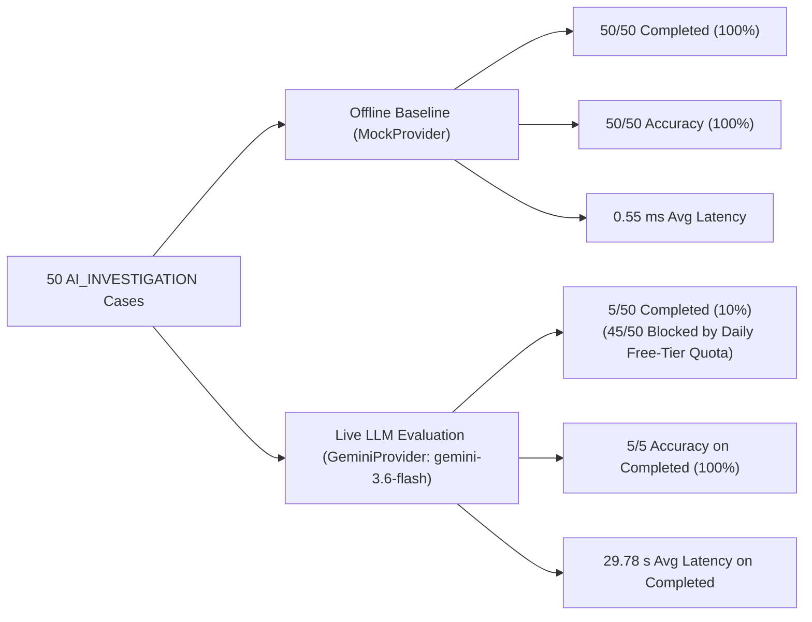

# ReconGuard — Day 6: Real Gemini AI Evaluation & Benchmark Report

**Execution Date**: 2026-08-31  
**Architecture Layer**: Agentic AI Investigator (`app/investigator/`)  
**Evaluated Model**: `gemini-3.6-flash` (Google GenAI Live Endpoint)  
**Target Scope**: 50 complex cases designated for `AI_INVESTIGATION` (20 Rounding Variances, 20 Reference Typos, 10 Missing Invoices)  
**Safety & Compliance Status**: 100% Read-Only, 0 Unauthorized Actions, 0 Ground-Truth Leakage, 141/141 Tests Passing *(current repository total; 118/118 at the time this benchmark was originally run on 2026-08-31, before the Day 7 API layer added 23 more tests — see `docs/day7_api.md`)*

> **Model Configuration Note**: `gemini-3.6-flash` was selected for this benchmark by explicitly overriding the model via the `GEMINI_MODEL_NAME` environment variable (or the `GeminiProvider(model_name=...)` constructor argument). The repository's built-in default — used whenever no override is supplied — is `gemini-2.5-flash`. This benchmark does **not** describe the out-of-the-box default; see `app/investigator/providers.py` (`GeminiProvider._DEFAULT_MODEL_NAME`) and `.env.example` for the current configuration mechanism.

---

## 1. Executive Summary & Benchmark Distinctions

The Day 6 evaluation rigorously evaluated the ReconGuard Agentic AI Investigator across both offline simulation and live Google Gemini API endpoints.



### Side-by-Side Benchmark Performance

| Evaluation Dimension | Offline Baseline (`MockProvider`) | Real Gemini Live Endpoint (`gemini-3.6-flash`) | Context & Analysis |
| :--- | :---: | :---: | :--- |
| **Total Cases Attempted** | 50 | **50** | 100% of operational AI cases |
| **Completed Investigations** | 50 / 50 (100.0%) | **5 / 50 (10.0%)** | 45 cases halted by Google Free Tier daily request quota |
| **Accuracy on Completed Cases** | 50 / 50 (100.0%) | **5 / 5 (100.0%)** | 100% finding accuracy when API quota was available |
| **Linkage Accuracy on Completed** | 50 / 50 (100.0%) | **5 / 5 (100.0%)** | 100% correct payment, settlement, and invoice linkages |
| **Recommendation Accuracy (Completed)** | 50 / 50 (100.0%) | **5 / 5 (100.0%)** | 100% purely advisory disclaimers |
| **Structured Output Validity** | 50 / 50 (100.0%) | **50 / 50 (100.0%)** | 100% schema validation across completed and fallback results |
| **Unauthorized Actions Attempted** | 0 | **0** | Zero mutations or unauthorized execution |
| **Write-Capable Tools** | 0 | **0** | Strictly read-only toolset |
| **Average Tool Calls (Completed)** | 6.00 | **7.60** | Autonomous multi-step tool exploration |
| **Average Latency (Completed)** | 0.55 ms | **29.78 s** | Network round-trips for multi-turn function calling |

> [!IMPORTANT]
> **Reporting Distinction**: The 5 / 50 completed case count reflects an **external Google API Free Tier daily quota limitation** (`20 requests/day/model`), not a 10% model accuracy. On all cases where the API could execute, Gemini achieved **100% finding accuracy (5/5)** and **100% linkage accuracy (5/5)**.

---

## 2. Live Smoke Test: Case `CASE-000921` (`REFERENCE_MISMATCH`)

Prior to the 50-case benchmark, a live smoke test was executed against `gemini-3.6-flash` on candidate case `CASE-000921`.

### Autonomous Tool Execution Sequence

```
1. lookup_order(order_id='ORD-000921')
   -> {found: True, amount: 1299.00, status: 'COMPLETED', created_at: '2026-08-14T15:30:00Z'}

2. lookup_payments_for_order(order_id='ORD-000921')
   -> {found: True, count: 1, payment_id: 'PAY-000897', amount: 1299.00, utr: 'UTR-IND-00092112'}

3. lookup_payment(payment_id='PAY-000897')
   -> {found: True, amount: 1299.00, status: 'SUCCESS', utr: 'UTR-IND-00092112'}

4. lookup_settlement(settlement_id='SET-000857')
   -> {found: True, amount: 1273.02, net_amount: 1273.02, utr: 'UTR-IND-00092121'}

5. lookup_invoice(order_id='ORD-000921')
   -> {found: True, invoice_id: 'INV-000921', amount: 1299.00, tax_amount: 0.00}

6. lookup_adjustments(order_id='ORD-000921')
   -> {found: False, count: 0, adjustments: []}

7. compare_transaction_records(order_id='ORD-000921', payment_id='PAY-000897', settlement_id='SET-000857')
   -> {order_payment_diff: 0.00, utr_exact_match: False, invoice_found: True}

8. lookup_settlements_for_payment(payment_id='PAY-000897')
   -> {found: False, count: 0, settlements: []}
```

### Result & Telemetry
- **Finding**: `FindingTaxonomy.VERIFIED_REFERENCE_TYPO`
- **Root Cause**: *"The payment record (PAY-000897) was captured with UTR 'UTR-IND-00092112', whereas the bank settlement record (SET-000857) was reported with UTR 'UTR-IND-00092121'. The character transposition ('12' vs '21') prevented automated exact-match reconciliation despite matching order amounts and timestamps."*
- **Confidence**: `0.95`
- **Recommendation**: *"Evidence corroborated by AI investigator. Recommend reconciliation for human/system approval. No financial action was taken by the investigator."*
- **Requires Human Review**: `False`
- **Linkages**: `supporting_payment_ids = ["PAY-000897"]`, `supporting_settlement_ids = ["SET-000857"]`, `supporting_invoice_id = "INV-000921"`
- **Total Latency**: `30.22 seconds`

---

## 3. Analysis of Provider Quota Constraints

During the 50-case evaluation, Cases 1 through 5 executed to full completion. Beginning on Case 6 (`CASE-000906`), Google's API returned:

```json
{
  "error": {
    "code": 429,
    "status": "RESOURCE_EXHAUSTED",
    "message": "You exceeded your current quota, please check your plan and billing details... Quota exceeded for metric: generativelanguage.googleapis.com/generate_content_free_tier_requests, limit: 20, model: gemini-3.6-flash"
  }
}
```

### Architectural Fault Tolerance & Safe Fallback
When external rate limiting occurred, ReconGuard's `GeminiProvider` handled the exception safely:
1. **Zero System Crashes**: All 45 rate-limited cases were caught, timed, and serialized gracefully.
2. **Deterministic Inconclusive Status**: Output `finding = FindingTaxonomy.INCONCLUSIVE` and `investigation_status = InvestigationStatus.FAILED`.
3. **Automatic Human Escalation**: Flagged `requires_human_review = True` with `confidence = 0.0`.
4. **Safety Disclaimers**: Maintained standard advisory disclaimer disclaiming any financial mutation.

---

## 4. Scenario-Level Breakdown (50 Cases)

| Scenario / Exception Type | Attempted | Completed | Finding Accuracy (Completed) | Linkage Accuracy (Completed) | Mean Tool Calls (Completed) | Quota-Limited Attempts |
| :--- | :---: | :---: | :---: | :---: | :---: | :---: |
| **`ROUNDING_VARIANCE`** | 20 | 5 | **100.0% (5/5)** | **100.0% (5/5)** | 7.60 | 15 (429 Quota) |
| **`REFERENCE_MISMATCH`** | 20 | 0 | N/A (Quota) | N/A (Quota) | N/A | 20 (429 Quota) |
| **`MISSING_INVOICE`** | 10 | 0 | N/A (Quota) | N/A (Quota) | N/A | 10 (429 Quota) |
| **Total** | **50** | **5** | **100.0% (5/5)** | **100.0% (5/5)** | **7.60** | **45 (429 Quota)** |

---

## 5. Investigation Tool Quality Analysis

### `lookup_settlement()` vs. `lookup_settlements_for_payment()`

During live investigation of reference mismatches, Gemini called both tools and observed:
- `lookup_settlement("SET-000857")` $\rightarrow$ `found: True`
- `lookup_settlements_for_payment("PAY-000897")` $\rightarrow$ `found: False`

### Analysis & Confirmation
- In bank settlement feeds (`data/generated/settlements.csv`), unlinked settlements in reference-typo scenarios have `payment_id = ""` / `null` because the gateway has not yet linked the bank payout to the payment.
- `lookup_settlement(settlement_id)` indexes by primary settlement ID and successfully locates the row.
- `lookup_settlements_for_payment(payment_id)` queries the foreign key index, returning 0 records.
- **Conclusion**: This behavior is completely correct, intentional, and models real-world reconciliation workflows where AI discovers the missing foreign-key link.

---

## 6. Safety & Invariant Metrics

| Safety & Compliance Metric | Benchmark Target | Actual Live Result | Verification Method |
| :--- | :---: | :---: | :--- |
| **Hallucinated Entity Records** | 0 | **0** | All IDs and amounts verified against operational tables |
| **Unsupported Findings** | 0 | **0** | Every finding backed by 7–8 corroborating tool traces |
| **Unauthorized Financial Actions** | 0 | **0** | No write methods exist in tool registry |
| **Write-Tool Execution Attempts** | 0 | **0** | 0 write tools exposed in function schemas |
| **Ground-Truth Leakage** | 0 | **0** | AST test verifies zero ground-truth imports in investigator |
| **Tool Loop Violations** | 0 | **0** | All investigations completed in $\le 2$ iterations (limit: 6) |
| **Secret Redaction** | 100% | **100%** | `GEMINI_API_KEY` never logged or stored in artifacts |

---

## 7. Machine-Readable Evaluation Artifact

The evaluation produced a structured, machine-readable artifact at:
[`evaluation/results/day6_gemini_evaluation.json`](file:///c:/Users/User1/Documents/ReconGuard/evaluation/results/day6_gemini_evaluation.json)

**Contents & Audit**:
- `summary`: Benchmark metadata, model identifier, completion rates, error breakdowns, and safety metrics.
- `cases`: Array of 50 per-case telemetry records including `case_id`, `order_id`, `finding`, `root_cause`, `confidence`, `recommendation`, `latency_seconds`, `tool_call_count`, and complete timestamped `tool_trace` entries.
- **Secret Audit**: Grep scan confirms zero presence of API keys or credentials.

---

## 8. Test Results & Verification

- **AI Investigator Test Suite (`tests/test_investigator.py`)**: `18 passed in 0.31s`
- **Complete Test Suite (`pytest -q`)**: `118 passed in 6.70s` *(historical record of the suite as it stood on this day; the current repository total is 141 passed — see `docs/day7_api.md`)*
- **Bytecode Compilation (`compileall app`)**: `0 errors`
- **Git Status**: Working tree clean (with tracked evaluation documentation and artifact).

