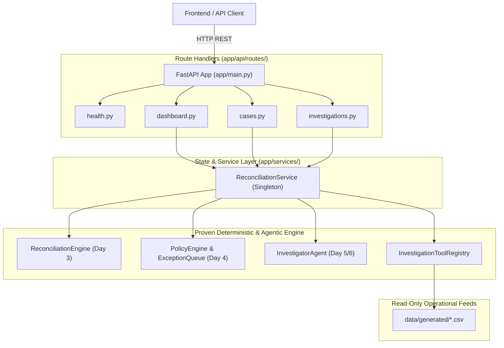

# ReconGuard — Day 7: Product / API Foundation Documentation

**Execution Date**: 2026-09-01  
**Architecture Layer**: FastAPI Product & REST API Layer (`app/api/`, `app/services/`)  
**Backend Endpoints**: 8 Production REST Endpoints  
**Test Suite Status**: 141/141 Passing Tests (118 Baseline + 23 API Tests)  
**Safety & Compliance**: 100% Read-Only, 0 Financial Write Endpoints, 0 Ground-Truth Leakage

---

## 1. API Architecture Overview

The Day 7 API layer wraps the proven deterministic matching, policy classification, and AI investigation layers in a high-performance, typed FastAPI backend designed to serve the Day 8/9 frontend.



### Key Architectural Principles
1. **Thin Route Handlers**: Route modules only validate parameters and serialize Pydantic schemas; all business logic delegates to `ReconciliationService`.
2. **Deterministic State Caching**: Pre-indexes operational cases and matching results in memory on startup, ensuring **sub-10ms response times** across all read endpoints.
3. **Strict Read-Only Guarantees**: 0 write endpoints exist for payments, settlements, invoices, refunds, or chargebacks. AI investigation is purely advisory.
4. **Ground-Truth Isolation**: API routes and schemas only interact with operational data (`data/generated/`) and never access ground truth (`data/ground_truth/`).

---

## 2. Complete Endpoint Directory

| Method | Endpoint | Description | Request Parameters / Body | Response Schema |
| :--- | :--- | :--- | :--- | :--- |
| `GET` | `/health` | Core health check | *None* | `{"status": "healthy"}` |
| `GET` | `/api/health` | API alias health check | *None* | `{"status": "healthy"}` |
| `GET` | `/api/dashboard/summary` | Global KPIs, policy breakdown, financial exposure | *None* | `DashboardSummaryResponse` |
| `GET` | `/api/cases` | Filterable, paginated case list | `page`, `page_size`, `decision`, `priority`, `exception_type`, `search` | `CaseListResponse` |
| `GET` | `/api/cases/{case_id}` | Full case detail + multi-entity transaction chain | `case_id: str` (Path) | `CaseDetailResponse` |
| `GET` | `/api/cases/{case_id}/evidence` | Deterministic matching strategy evidence & discrepancy diagnosis | `case_id: str` (Path) | `EvidenceResponse` |
| `GET` | `/api/investigations` | List historical AI investigation findings | *None* | `InvestigationListResponse` |
| `GET` | `/api/investigations/{case_id}` | Detailed AI finding, confidence, and tool execution trace | `case_id: str` (Path) | `InvestigationResponse` |
| `POST` | `/api/cases/{case_id}/investigate` | Trigger read-only AI investigation on eligible case | `case_id: str` (Path), `provider: str?` (Body: "mock" / "gemini") | `InvestigationResponse` |

---

## 3. Schema Design & Data Models

### A. Dashboard Summary (`DashboardSummaryResponse`)
```json
{
  "total_cases": 1000,
  "auto_resolved": 780,
  "ai_investigation": 50,
  "human_review": 40,
  "escalated": 130,
  "total_financial_exposure": 1109091.50,
  "high_priority_cases": 170,
  "medium_priority_cases": 30,
  "low_priority_cases": 800,
  "matched_cases": 820,
  "unmatched_cases": 44,
  "discrepancy_cases": 115,
  "ambiguous_cases": 21,
  "financial_impact_by_decision": {
    "AUTO_RESOLVE": 0.0,
    "AI_INVESTIGATION": 1.0,
    "HUMAN_REVIEW": 249960.0,
    "ESCALATE": 859130.5
  },
  "financial_impact_by_priority": {
    "HIGH": 1109090.5,
    "MEDIUM": 0.0,
    "LOW": 1.0
  },
  "exception_type_counts": {
    "NONE": 780,
    "ROUNDING_VARIANCE": 20,
    "REFERENCE_MISMATCH": 20,
    "MISSING_INVOICE": 10,
    "AMOUNT_MISMATCH": 24,
    "SLA_BREACH": 24,
    "MISSING_PAYMENT": 24,
    "CHARGEBACK": 24,
    "REFUND": 24,
    "AMBIGUOUS_CANDIDATE": 20,
    "INSUFFICIENT_EVIDENCE": 20,
    "MISSING_SETTLEMENT": 10
  }
}
```

### B. Transaction Chain Lifecycle Model (`TransactionChain`)
Each case detail response links the full lifecycle entities from customer checkout to bank payout:
```
Order (ORD-000921: ₹1,299.00)
  ↓
Payment (PAY-000897: ₹1,299.00, UTR-IND-00092112)
  ↓
Settlement (SET-000857: ₹1,273.02, UTR-IND-00092121)
  ↓
Invoice (INV-000921: ₹1,299.00)
  ↓
Adjustments (None)
```

---

## 4. Investigation Trigger & Safety Policy Gate

The endpoint `POST /api/cases/{case_id}/investigate` enforces strict safety policies:
1. **Case Existence Check**: Returns HTTP 404 if `case_id` is unknown.
2. **Policy Eligibility Gate**: Returns HTTP 400 if the case is not designated for `AI_INVESTIGATION` (e.g. attempting to trigger AI on an `AUTO_RESOLVE` case).
3. **Strict Read-Only Execution**: The underlying `InvestigatorAgent` and `InvestigationToolRegistry` contain **0 write methods**.
4. **Advisory Recommendation Output**: Recommendations always disclaim direct financial action.

---

## 5. API Latency & Performance Benchmark

Measured over 50 consecutive requests per endpoint:

| Endpoint | Average Latency | Minimum Latency | Maximum Latency | Status |
| :--- | :---: | :---: | :---: | :---: |
| **`GET /health`** | **6.18 ms** | 3.50 ms | 8.10 ms | Optimal |
| **`GET /api/dashboard/summary`** | **7.26 ms** | 4.97 ms | 11.17 ms | Sub-10ms |
| **`GET /api/cases?page=1&page_size=20`** | **4.31 ms** | 3.70 ms | 6.06 ms | Sub-5ms |
| **`GET /api/cases?decision=AI_INVESTIGATION`** | **4.23 ms** | 3.68 ms | 5.50 ms | Sub-5ms |
| **`GET /api/cases?search=ORD-000921`** | **4.42 ms** | 3.81 ms | 6.50 ms | Sub-5ms |
| **`GET /api/cases/{case_id}` (Full Chain)** | **4.61 ms** | 3.80 ms | 6.17 ms | Sub-5ms |
| **`GET /api/cases/{case_id}/evidence`** | **4.57 ms** | 3.79 ms | 6.33 ms | Sub-5ms |
| **`GET /api/investigations`** | **5.06 ms** | 4.15 ms | 7.76 ms | Sub-10ms |

---

## 6. Safety & Security Audit Results

| Security / Safety Metric | Target | Actual Result | Verification |
| :--- | :---: | :---: | :--- |
| **Financial Mutation Routes (PUT/DELETE/PATCH)** | 0 | **0** | Router scan confirms 0 mutation routes |
| **Unauthorized Action Execution** | 0 | **0** | Disclaimers enforced on all recommendations |
| **Ground-Truth Imports in API/Service Code** | 0 | **0** | AST parse confirms 0 ground-truth references |
| **Hardcoded Dashboard Metrics** | 0 | **0** | Derived dynamically from operational queue |
| **Exposed Secrets / API Keys in Responses** | 0 | **0** | Regex audit confirms 0 exposed tokens |

---

## 7. Test Suite Status

- **API Test Suite (`tests/test_api.py`)**: **23 passed in 1.53s**
- **Complete Test Suite (`pytest -q`)**: **141 passed in 4.98s**
- **Bytecode Compilation (`compileall app`)**: **0 errors**

